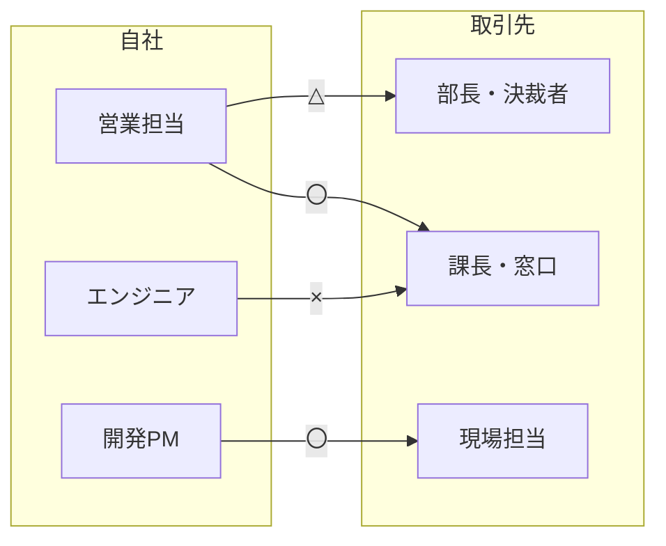

# 取引先との関係を可視化する「パワーストラクチャ」研修レポート

先日の社内研修で「パワーストラクチャ」を学びました。実際に図を作る演習を通して、取引先との関係を整理する方法を体験したので、その内容をまとめます。

エンジニアも取引先とやり取りする機会は多いため、営業職に限らず役立つ考え方だと感じました。

---

## 1. パワーストラクチャとは

パワーストラクチャとは、**自社と取引先それぞれの人員構成を図にし、人と人との関係性を書き込んだもの**です。

「誰が決裁権を持っているのか」「誰と誰がつながっているのか」「どこに関係の空白があるのか」を一枚の図で把握できます。

一般に、案件が進まない原因は技術や価格ではなく、**関係性の偏りや抜け**にあることが少なくありません。それを見える形にするためのツールです。

## 2. 作り方

研修では、次の手順で作成しました。

1. **取引先の組織図を書く**
   部長・課長・現場担当など、役職や役割ごとにボックスを並べます。
2. **自社側の人員を書く**
   営業、PM、エンジニアなど、その取引先に関わっているメンバーを並べます。
3. **人と人を線でつなぐ**
   実際に接点のある組み合わせに線を引きます。
4. **線に〇△×で関係性を書き込む**
   関係の良し悪しを記号で表します(次章)。
5. **図全体を眺めて分析する**
   偏りや空白、リスクを洗い出します。

## 3. 〇△×の考え方

関係性は次の3段階で表現しました。

| 記号 | 意味 | 目安 |
| --- | --- | --- |
| 〇 | 良好 | 信頼されており、率直に相談や情報交換ができる |
| △ | 普通・浅い | 面識はあるが、深い話まではできていない |
| × | 課題あり | 関係が悪い、または接点がほとんどない |

ポイントは、**主観で構わないので正直に評価すること**です。実態より良く書いても、図の意味がなくなってしまいます。

> ※ 記号の定義は研修や組織によって異なる場合があります。ここでは研修で扱った内容をもとに、一般的な表現で整理しています。

## 4. 図の例

以下は説明用に作成した架空の例です。

この図から、次のようなことが読み取れます。

- **決裁者(部長)との関係が△**で、営業担当ひとりに依存している
- 窓口の課長とは営業が〇である一方、エンジニアとは×で、技術面の意思疎通に課題がある
- 現場担当とはPMが〇で、現場の情報はPM経由で取れている

## 5. 演習で気づいたこと

実際に自分たちの取引先で図を作ってみると、次のような気づきがありました。

- **意外と知らない部分が多い。** 取引先の組織図や、誰が決裁者なのかを正確に把握できていませんでした。
- **関係が特定の人に集中している。** その人が異動や退職をすると、関係が一気に途切れるリスクがあります。
- **×や空白が見えると、次の行動が決まる。** 「誰が誰に会いに行くか」を具体的に考えられるようになります。
- **チームで作ると認識のズレが分かる。** 同じ相手でも、人によって〇△×の評価が違うことがありました。

## 6. 開発の現場での活かし方

エンジニアの立場でも、次のような場面で活用できると考えています。

- 要件のヒアリング時に、**誰が最終的な判断者か**を確認する
- 仕様変更や追加要望が出たとき、**誰の意向が強いか**を見極める
- 定例会などで、**接点の薄い相手との対話の機会**を意識的につくる
- 担当交代のときに、**関係性の引き継ぎ資料**として使う

技術的に正しいものを作っても、決裁者や現場の納得がなければ採用されません。パワーストラクチャは、そうした認識のギャップを減らす助けになります。

## 7. まとめ

- パワーストラクチャは、**人員構成と関係性を〇△×で可視化する**手法です。
- 作ること自体が、**取引先への理解不足に気づくきっかけ**になります。
- 図ができたら、**偏り・空白・属人化のリスク**を確認し、次のアクションにつなげます。
- 一度作って終わりにせず、**定期的に更新する**ことで効果が出ます。

まずは、担当している取引先のひとつで、簡単な図を作ってみることをおすすめします。
